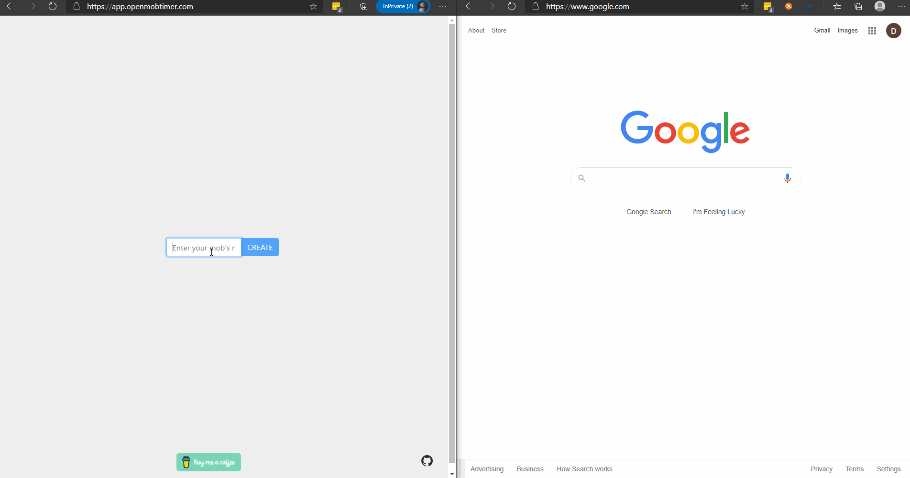

## Welcome!
Open Mob Timer isn't just any mob timer. Nope! This one integrates socket.io to keep everyone in the loop while still keeping it simple.

Create a team, then copy the link to share with your team members. Everyone with the link can keep an eye on the timer without having to rely on Jerry G to remember to start the timer between drivers. Dang it, Jerry!  

> 

[Start Mobbing](https://app.openmobtimer.com)
### Features
#### Websockets
Everyone with the team url in the browser has control, encouraging the self-organizing team.

#### No login required
Just create a mob and add users. Keep track of your unique url for mobbing all week, month, year, and so on.

#### Simple
Start, stop, set away, and delete. Not much else to know!
