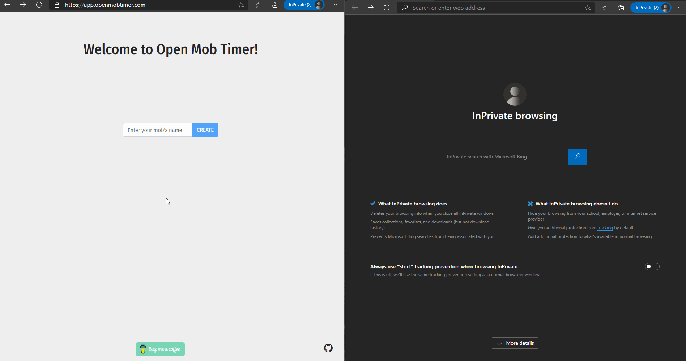

## Welcome!
Open Mob Timer isn't just any mob timer. Nope! This one integrates socket.io to keep everyone in the loop while still keeping it simple.

Create a team, then copy the link to share with your team members. Everyone with the link can keep an eye on the timer without having to rely on Jerry to remember to start the timer between drivers. Sorry, not sorry, Jerry.

> 

[Start Mobbing](https://app.openmobtimer.com)

### User Guide
- **Start** - Starts a 15-minute timer for the indicated team member
- **Stop** - Stops the timer
- **Set Away** - Prevents timers from being started for the indicated team member
- **Delete** - Removes the team member

### Features
#### Websockets
Everyone with the team url in the browser has control, encouraging self-organizing teams.

#### Desktop Notifications
Desktop notifications let everyone know when a timer is started or stopped, and whenever someone's turn is over.

#### No login required
Just create a mob and add users. Keep track of your unique url for mobbing all week, month, year, and so on.

#### Simple
